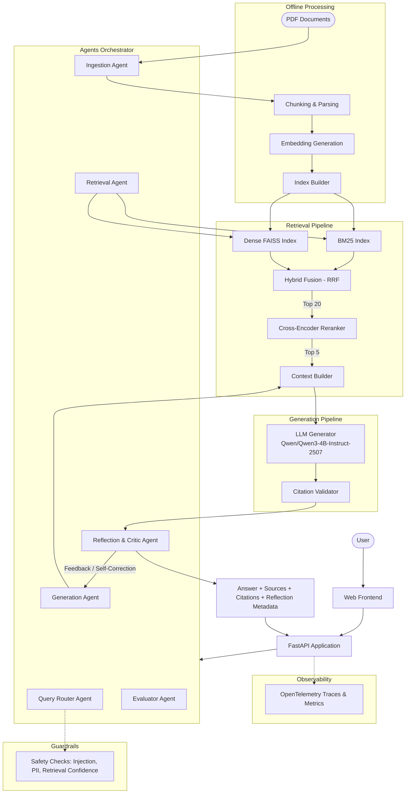

# Multimodal Document Intelligence

> Production-grade RAG and Autonomous Agent system with hybrid retrieval, cross-encoder reranking, Qwen3 LLM generation, multi-agent reflection and validation, structured evaluation, and deep observability.


## Architecture



## Autonomous Agent System

The pipeline features a modular agent system coordinating each stage of execution:

- **Query Router Agent**: Analyzes intent and complexity to route queries to direct answer, hybrid RAG, or clarification workflows.
- **Retrieval Agent**: Coordinates BM25 and FAISS vector retrieval, reciprocal rank fusion (RRF), and cross-encoder reranking with adaptive score thresholds.
- **Generation Agent**: Synthesizes grounded answers using `Qwen/Qwen3-4B-Instruct-2507` with hardware acceleration (bfloat16 / MPS / CUDA) and citation formatting.
- **Reflection & Critic Agent**: Performs self-reflection, verifies factual faithfulness against context chunks, checks citation validity, and triggers corrective retrieval or regeneration if needed.
- **Ingestion Agent**: Validates uploaded documents, assesses text density and formatting quality, and optimizes chunking strategies.
- **Evaluator Agent**: Continuously runs automated regression checks against benchmark datasets to evaluate Recall@K, MRR, NDCG@K, Faithfulness, and Citation accuracy against defined SLAs.

## Quick Start

### 1. Setup

```bash
python3 -m venv .venv
source .venv/bin/activate
pip install -r requirements.txt
```

### 2. Run the API

```bash
uvicorn api.main:app --reload
```

Open [http://127.0.0.1:8000](http://127.0.0.1:8000) for the web UI, or [http://127.0.0.1:8000/docs](http://127.0.0.1:8000/docs) for the interactive OpenAPI docs.

### 3. Upload PDFs & Ask Questions

1. Drag and drop PDF files into the upload zone.
2. Click "Process Documents" to run parsing, chunking, and FAISS/BM25 indexing.
3. Ask questions in the chat interface to receive grounded answers with citations.

## API Endpoints

| Method | Endpoint | Description |
|--------|----------|-------------|
| `POST` | `/ingest` | Upload PDF(s) and build the retrieval indices |
| `POST` | `/query` | Standard RAG: question → answer + citations |
| `POST` | `/orchestrate/query` | **Multi-Agent Query**: routing, reflection, hallucination critique & self-correction |
| `POST` | `/orchestrate/ingest` | **Autonomous Ingest**: document quality verification, parsing & index validation |
| `POST` | `/orchestrate/validate` | **Pipeline Validation**: executes benchmark evaluation against target SLAs |
| `GET` | `/health` | Health and index readiness check |
| `GET` | `/metrics` | Pipeline latency and performance metrics |
| `POST` | `/evaluate`| Run the full RAG evaluation suite |

### Example Query (Agentic Orchestration)

```bash
curl -X POST http://localhost:8000/orchestrate/query \
  -H "Content-Type: application/json" \
  -d '{"question": "What optimizer is used?", "max_iterations": 2}'
```

Response:
```json
{
  "answer": "The model uses AdamW [Source: paper.pdf, Page 4].",
  "sources": [{"document": "paper.pdf", "page": 4, "score": 0.95}],
  "citations": [{"document": "paper.pdf", "page": 4, "is_valid": true}],
  "reflection": {
    "is_faithful": true,
    "confidence_score": 0.96,
    "critique": "Answer directly supported by page 4."
  },
  "timings": {"retrieval_ms": 78, "reranking_ms": 190, "generation_ms": 850}
}
```

## Project Structure

```
├── agents/               # Multi-agent orchestrator, router, reflection, evaluator, etc.
├── api/                  # FastAPI backend with standard and agentic endpoints
├── configs/              # YAML pipeline configurations (default, experiments)
├── evaluation/           # Retrieval, generation, citation metrics & LLM judge
├── experiments/          # Experiment tracking, results & config variants
├── generation/           # Qwen3 causal LM generator, prompts, citation parser
├── guardrails/           # Safety checks (prompt injection, PII, confidence bounds)
├── indices/              # Pre-built FAISS vector indices and BM25 search indices
├── ingestion/            # PDF parsing, semantic chunking, embedding, indexing
├── observability/        # OpenTelemetry tracing, Prometheus metrics, structured logs
├── tests/                # Unit, integration, and agent validation test suite
├── traces/               # Local trace logs and spans
├── web/                  # Web interface (HTML/CSS/JS) with real-time stats
├── Dockerfile            # Container build specification
├── docker-compose.yml    # Multi-service container orchestration
└── render.yaml           # Cloud deployment configuration
```

## Evaluation & Benchmarks

Run the evaluation suite against ground truth datasets:

```bash
python -m evaluation.runner \
  --config configs/default.yaml \
  --dataset evaluation/datasets/eval_set.jsonl \
  --output experiments/results/
```

### Metrics Tracked

| Category | Metrics | SLA Target |
|----------|---------|------------|
| **Retrieval** | Recall@K, MRR, NDCG@K, Precision@K | Recall@5 ≥ 0.60, MRR ≥ 0.50 |
| **Generation** | Exact Match, Token F1, Contains Match | Contains Match ≥ 0.50 |
| **Citation** | Citation Precision, Recall, Citation F1 | Citation Score ≥ 0.70 |
| **LLM Judge** | Correctness, Faithfulness, Relevance, Citation Quality | Faithfulness ≥ 0.70 |

## Experiments

Benchmark individual pipeline components across configuration profiles:

```bash
# 1. BM25 Lexical search only
python -m evaluation.runner --config experiments/configs/bm25_only.yaml

# 2. Dense FAISS search only
python -m evaluation.runner --config experiments/configs/dense_only.yaml

# 3. Hybrid Fusion + Cross-Encoder Reranker
python -m evaluation.runner --config experiments/configs/hybrid_reranker.yaml
```

## Testing & Quality Assurance

Run the test suite:

```bash
# Run all unit and integration tests
pytest tests/ -v

# Run linter
ruff check .
```

## Configuration

All system parameters are driven declaratively via `configs/default.yaml`:

- **Ingestion**: `chunk_size` (300), `chunk_overlap` (50), `pdf_parser` (`pdfplumber`)
- **Retrieval**: `bm25_enabled`, `dense_enabled`, `top_k_initial` (20), `embedding_model` (`all-MiniLM-L6-v2`), `fusion_method` (`rrf`)
- **Reranker**: `enabled`, `model` (`cross-encoder/ms-marco-MiniLM-L-6-v2`), `top_k_final` (5)
- **Generation**: `model` (`Qwen/Qwen3-4B-Instruct-2507`), `max_new_tokens` (500), `max_input_tokens` (2048), `temperature` (0.1)
- **Orchestration**: `agentic_query_enabled`, `faithfulness_threshold` (0.70), `sla_thresholds` (Recall, MRR, Citation Score)
- **Observability**: OpenTelemetry tracing, Prometheus metrics, structured logs

## License

MIT
