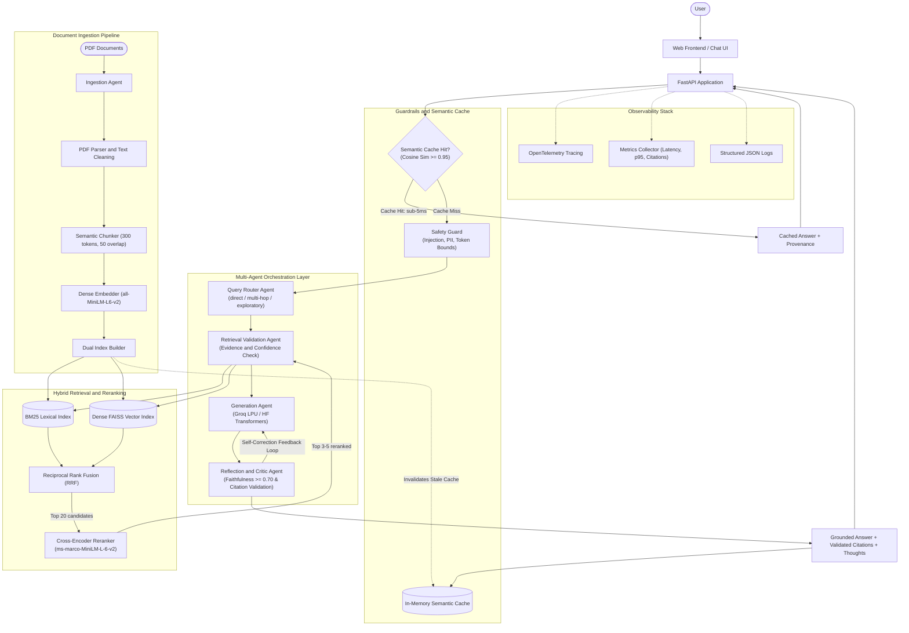

# Multimodal Document Intelligence

> Production-grade RAG and Autonomous Multi-Agent System featuring hybrid retrieval, cross-encoder reranking, multi-provider LLM generation (Groq Cloud & Local HuggingFace), sub-millisecond semantic caching, multi-agent reflection and self-correction, rigorous SLA evaluation, and end-to-end observability.

[](https://www.python.org/)
[](https://fastapi.tiangolo.com/)
[](https://groq.com/)
[](https://huggingface.co/)
[]()
[](LICENSE)

---

## Key Highlights

- **Autonomous Multi-Agent Orchestration**: Router, Retrieval Validation, Generation, Reflection & Critic, Ingestion, and Pipeline Evaluator agents coordinate to eliminate hallucinations and enforce factual groundedness.
- **Sub-Millisecond Semantic Caching**: In-memory embedding cache with cosine similarity matching ($\ge 0.95$) bypasses the full retrieval and LLM pipeline for identical or semantically equivalent queries, dropping latency to $< 5\text{ms}$.
- **Dual LLM Provider Support**:
  - **Groq Cloud API**: Ultra-high-throughput LPU inference supporting `llama-3.3-70b-versatile`, `llama-3.1-8b-instant`, `openai/gpt-oss-120b`, `deepseek-r1-distill-llama-70b`, and `qwen-2.5-32b`.
  - **Local HuggingFace Transformers**: Local execution supporting causal LMs (`Qwen/Qwen3-4B-Instruct-2507`, Mistral, LLaMA) with `bfloat16`/MPS/CUDA hardware acceleration, reasoning block extraction (`<think>...</think>`), and seq2seq fallbacks (`google/flan-t5-base`).
- **Hybrid Retrieval & Cross-Encoder Reranking**: Combines BM25 lexical search and dense FAISS vector search via Reciprocal Rank Fusion (RRF, weights 0.4 / 0.6), followed by Cross-Encoder reranking (`ms-marco-MiniLM-L-6-v2`).
- **Self-Correction & Reflection**: Validates answers against retrieved chunks with a strict Faithfulness threshold ($\ge 0.70$); auto-corrects citations and re-verifies evidence when claims are unsupported.
- **Defense-in-Depth Guardrails**: Real-time prompt injection detection, PII masking (SSNs, emails, credit cards, phones), and retrieval confidence bounds.
- **Production Observability**: Built-in OpenTelemetry tracing, Prometheus-compatible `/metrics` endpoint with latency percentiles ($p50, p95$), request throughput, and citation accuracy.
- **Interactive Web Interface**: Clean glassmorphism UI for drag-and-drop PDF ingestion, live agent thought inspection, citation verification badges, and real-time SLA metrics.

---

## Architecture



---

## Multi-Agent System

The architecture delegates specialized responsibilities to dedicated agents:

| Agent | Responsibility | Key Mechanics & SLA |
|---|---|---|
| **Query Router Agent** | Analyzes input complexity and user intent | Classifies intent into `direct`, `multi_hop` (decomposes into sub-queries), or `exploratory` (expands query). |
| **Retrieval Validation Agent** | Manages hybrid search and evaluates evidence sufficiency | Fuses BM25 and FAISS using RRF, reranks via Cross-Encoder, enforces confidence threshold ($\ge 0.10$). |
| **Generation Agent** | Produces grounded answers with inline citations | Dispatches to Groq LPU or local Hugging Face model; extracts reasoning blocks (`<think>...</think>`), injects fallback citations. |
| **Reflection & Critic Agent** | Evaluates factual fidelity and citation validity | Audits claims against source chunks (Faithfulness SLA $\ge 0.70$); triggers automated self-correction when citations fail. |
| **Ingestion Agent** | Pre-validates documents and audits index builds | Verifies PDF integrity, checks text density and table structures, confirms vector count matches chunk count. |
| **Pipeline Validator Agent** | Continuous SLA audit against benchmark datasets | Computes Recall@5, MRR, Contains Match, Citation Accuracy, and LLM Judge Faithfulness against defined thresholds. |

---

## Semantic Caching

To optimize response times and avoid redundant LLM calls, an in-memory **Semantic Cache** is positioned in front of the retrieval pipeline:

- **Lookup Mechanics**: Computes cosine similarity between incoming query embedding and cached question embeddings using $L_2$-normalized vectors from `sentence-transformers/all-MiniLM-L6-v2`.
- **Threshold**: Similarity $\ge 0.95$ triggers a cache hit.
- **Latency Reduction**: Serves cached responses in **$< 5\text{ms}$** (with retrieval and generation reported as $0.0\text{ms}$).
- **Automatic Invalidation**: Whenever new documents are ingested via `/ingest` or `/orchestrate/ingest`, the semantic cache is automatically cleared to ensure freshness.
- **Metadata Provenance**: Returns `cached: true`, `cached_similarity`, and `matched_question` in response metadata.

---

## Dual LLM Provider Support

Configure your desired inference engine in `configs/default.yaml` or through environment variables:

### 1. Groq Cloud API (High Speed & Throughput)

Ideal for production and development without heavy local GPU requirements:
- **Default Models**: `openai/gpt-oss-120b`, `llama-3.3-70b-versatile`, `llama-3.1-8b-instant`, `qwen-2.5-32b`, `deepseek-r1-distill-llama-70b`
- **Configuration** in `configs/default.yaml`:
  ```yaml
  generation:
    provider: groq
    model: openai/gpt-oss-120b # or llama-3.3-70b-versatile
    max_new_tokens: 500
    max_input_tokens: 1024
    temperature: 0.1
  ```
- Requires `GROQ_API_KEY` set in your `.env` file or environment.

### 2. Local Hugging Face Transformers (Air-Gapped / Private)

Ideal for fully private, on-device execution:
- **Supported Models**: `Qwen/Qwen3-4B-Instruct-2507`, Mistral, LLaMA, `google/flan-t5-base`
- **Configuration** in `configs/default.yaml`:
  ```yaml
  generation:
    provider: huggingface
    model: Qwen/Qwen3-4B-Instruct-2507
    max_new_tokens: 500
    max_input_tokens: 2048
    temperature: 0.1
  ```
- **Hardware Acceleration**: Automatically selects `mps` on Apple Silicon, `cuda` on NVIDIA GPUs (with `torch.bfloat16`), or `cpu`.

---

## Quick Start

### 1. Environment Setup

```bash
# Clone the repository and enter the directory
git clone https://github.com/Nadigsrujan/RAG-eval.git
cd RAG-eval

# Create and activate virtual environment
python3 -m venv .venv
source .venv/bin/activate

# Install dependencies
pip install -r requirements.txt
```

### 2. Configure Environment Variables

Copy the example environment file and add your Groq API key (if using Groq):

```bash
cp .env.example 
```

Edit `.env`:
```env
GROQ_API_KEY=gsk_your_groq_api_key_here
```

### 3. Launch the API & Web Dashboard

```bash
uvicorn api.main:app --reload
```

- **Web Dashboard**: [http://127.0.0.1:8000](http://127.0.0.1:8000)
- **Interactive OpenAPI Documentation**: [http://127.0.0.1:8000/docs](http://127.0.0.1:8000/docs)

---

## API Reference

### Core Endpoints

| Method | Endpoint | Description |
|---|---|---|
| `POST` | `/orchestrate/query` | **Recommended**: Full multi-agent workflow (routing, hybrid search, reflection, self-correction, semantic cache) |
| `POST` | `/orchestrate/ingest` | Agentic document ingestion with document quality verification and index audits |
| `POST` | `/orchestrate/validate` | On-demand pipeline SLA audit evaluating benchmark datasets against quality gates |
| `POST` | `/ingest` | Standard PDF upload, chunking, and dual index creation |
| `POST` | `/query` | Direct RAG query with semantic cache check |
| `GET` | `/health` | Health check reporting index status, chunk count, and model readiness |
| `GET` | `/metrics` | Performance telemetry (total queries, $p50/p95$ latency, citation accuracy) |
| `POST` | `/evaluate` | Executes full evaluation suite over evaluation datasets |

---

### Example cURL Queries

#### 1. Ingest Documents

```bash
curl -X POST http://localhost:8000/orchestrate/ingest \
  -F "files=@/path/to/document.pdf"
```

Response:
```json
{
  "status": "success",
  "documents_processed": 1,
  "chunks_created": 42,
  "audit": {
    "documents_count": 1,
    "chunks_count": 42,
    "vector_index_count": 42,
    "bm25_index_count": 42,
    "canary_search_passed": true
  },
  "message": "Ingestion verified: 1 documents, 42 chunks, dual indices aligned."
}
```

#### 2. Query with Multi-Agent Orchestration

```bash
curl -X POST http://localhost:8000/orchestrate/query \
  -H "Content-Type: application/json" \
  -d '{
    "question": "What optimizer is used and what is the learning rate?",
    "top_k": 5
  }'
```

Response:
```json
{
  "answer": "The model is trained using the AdamW optimizer with a base learning rate of 1e-4 [Source: document.pdf, Page 4].",
  "intent": "direct",
  "sub_queries": [],
  "sources": [
    {
      "document": "document.pdf",
      "page": 4,
      "score": 0.892
    }
  ],
  "citations": [
    {
      "document": "document.pdf",
      "page": 4,
      "is_valid": true,
      "reason": "Direct textual match in chunk."
    }
  ],
  "agent_thoughts": [
    {
      "agent": "QueryRouterAgent",
      "step": "classify_intent",
      "thought": "Direct query identified. Routing directly to hybrid retrieval.",
      "status": "ok",
      "latency_ms": 12.4
    },
    {
      "agent": "RetrievalValidationAgent",
      "step": "validate_evidence",
      "thought": "Retrieved 3 chunks via RRF and Cross-Encoder. Max score 0.892 satisfies threshold (>= 0.10).",
      "status": "ok",
      "latency_ms": 145.8
    },
    {
      "agent": "ReflectionValidatorAgent",
      "step": "faithfulness_and_citation_audit",
      "thought": "Answer verified: Faithfulness score 0.95 >= 0.70. All citations valid.",
      "status": "ok",
      "latency_ms": 48.2
    }
  ],
  "validation": {
    "retrieval_valid": true,
    "retrieval_score": 0.892,
    "faithfulness_score": 0.95,
    "citation_accuracy": 1.0,
    "self_corrected": false,
    "validation_reasons": ["Retrieval confidence passed", "All citations verified"]
  },
  "timings": {
    "retrieval_ms": 145.8,
    "reranking_ms": 82.1,
    "generation_ms": 412.0,
    "citation_ms": 48.2,
    "total_ms": 688.1
  },
  "metadata": {}
}
```

#### 3. Semantic Cache Hit

Repeating the same or a semantically equivalent query:

```bash
curl -X POST http://localhost:8000/orchestrate/query \
  -H "Content-Type: application/json" \
  -d '{"question": "Can you tell me which optimizer and learning rate were used?"}'
```

Response includes cached metadata and instant turnaround:
```json
{
  "answer": "The model is trained using the AdamW optimizer with a base learning rate of 1e-4 [Source: document.pdf, Page 4].",
  "timings": {
    "retrieval_ms": 0.0,
    "reranking_ms": 0.0,
    "generation_ms": 0.0,
    "citation_ms": 0.0,
    "total_ms": 3.8
  },
  "metadata": {
    "cached": true,
    "cached_similarity": 0.9624,
    "matched_question": "What optimizer is used and what is the learning rate?"
  }
}
```

#### 4. Metrics & SLA Telemetry

```bash
curl -X GET http://localhost:8000/metrics
```

```json
{
  "total_queries": 28,
  "avg_latency_ms": 245.2,
  "p95_latency_ms": 688.1,
  "avg_retrieval_ms": 94.6,
  "avg_generation_ms": 150.6,
  "avg_citation_score": 0.9750
}
```

---

## Configuration Reference

All pipeline behaviors are controlled in `configs/default.yaml`:

```yaml
ingestion:
  chunk_size: 300               # Tokens per chunk
  chunk_overlap: 50             # Overlap tokens
  pdf_parser: pdfplumber        # pdfplumber | pypdf2

retrieval:
  bm25_enabled: true            # Lexical retrieval
  dense_enabled: true           # Vector retrieval (FAISS)
  top_k_initial: 20             # Candidates retrieved before reranking
  embedding_model: sentence-transformers/all-MiniLM-L6-v2
  fusion_method: rrf            # rrf | weighted
  fusion_weights:
    bm25: 0.4
    dense: 0.6

reranker:
  enabled: true
  model: cross-encoder/ms-marco-MiniLM-L-6-v2
  top_k_final: 3                # Final chunks provided to generator

generation:
  provider: groq                # groq | huggingface
  model: openai/gpt-oss-120b    # Groq model alias or HuggingFace ID
  max_new_tokens: 500
  max_input_tokens: 1024
  temperature: 0.1
  prompt_version: v1

observability:
  tracing_enabled: true
  metrics_enabled: true
  log_level: INFO
  trace_dir: traces/
  log_dir: logs/

orchestration:
  enabled: true
  agentic_query_enabled: true
  min_retrieval_confidence: 0.10 # Minimum acceptable retrieval score
  faithfulness_threshold: 0.70   # Target SLA for LLM factual reflection
  sla_thresholds:
    recall_at_5: 0.60
    mrr: 0.50
    contains_match: 0.50
    citation_score: 0.70
```

---

## Evaluation & Benchmarks

Run automated evaluation against ground-truth datasets to test retrieval, generation, citation precision, and LLM judge faithfulness:

```bash
python -m evaluation.runner \
  --config configs/default.yaml \
  --dataset evaluation/datasets/eval_set.jsonl \
  --output experiments/results/
```

### Production SLA Quality Gates

| Evaluation Category | Metric | SLA Target | Description |
|---|---|---|---|
| **Retrieval** | Recall@5 | $\ge 0.60$ | Ratio of relevant context chunks present in top 5 |
| **Retrieval** | MRR | $\ge 0.50$ | Mean Reciprocal Rank of first relevant chunk |
| **Generation** | Contains Match | $\ge 0.50$ | Ground-truth answer keywords captured in output |
| **Citation** | Citation Score | $\ge 0.70$ | Precision and recall of inline document/page citations |
| **LLM Judge** | Faithfulness | $\ge 0.70$ | Absence of ungrounded or hallucinated claims |

### Comparative Ablation Experiments

Compare retrieval strategies by running experiment configurations:

```bash
# 1. BM25 Lexical Search Only
python -m evaluation.runner --config experiments/configs/bm25_only.yaml

# 2. Dense Vector Search Only (FAISS)
python -m evaluation.runner --config experiments/configs/dense_only.yaml

# 3. Hybrid Fusion + Cross-Encoder Reranking
python -m evaluation.runner --config experiments/configs/hybrid_reranker.yaml
```

---

## Testing & Quality Assurance

Run the test suite (93 unit, integration, and agent orchestration tests):

```bash
# Run full test suite
.venv/bin/pytest tests/ -v

# Run linter
.venv/bin/ruff check .
```

---

## Docker & Container Deployment

### Build and Run with Docker

```bash
# Build Docker image
docker build -t multimodal-doc-intelligence .

# Run container with environment file
docker run -p 8000:8000 --env-file .env multimodal-doc-intelligence
```

### Run with Docker Compose

```bash
docker compose up -d
```

---

## Project Structure

```
.
├── .env.example              # Template environment variables 
├── Dockerfile                # Production container build
├── docker-compose.yml        # Docker compose configuration
├── requirements.txt          # Python dependencies
├── pyproject.toml            # Project metadata and tooling configs
├── render.yaml               # Cloud deployment configuration
│
├── agents/                   # Multi-agent orchestration layer
│   ├── orchestrator.py       # Coordinated multi-agent workflow
│   ├── router.py             # Query Router Agent (direct / multi-hop / exploratory)
│   ├── retrieval_agent.py    # Retrieval Validation Agent
│   ├── generation_agent.py   # Generation Agent
│   ├── reflection_agent.py   # Reflection, Faithfulness & Self-Correction Agent
│   ├── ingestion_agent.py    # Document validation & Ingestion Agent
│   └── evaluator_agent.py    # Continuous pipeline SLA validator
│
├── api/                      # FastAPI application
│   └── main.py               # REST API endpoints, streaming UI, error handlers
│
├── configs/                  # YAML configuration files
│   └── default.yaml          # Master pipeline configuration
│
├── evaluation/               # Metrics, runner, and benchmark datasets
│   ├── runner.py             # CLI evaluation benchmark runner
│   ├── retrieval_eval.py     # Recall@K, MRR, NDCG@K, Precision@K
│   ├── generation_eval.py    # Exact Match, Token F1, Contains Match
│   ├── citation_eval.py      # Citation Precision, Recall, Citation F1
│   ├── llm_judge.py          # LLM-as-a-judge (faithfulness, relevance)
│   └── datasets/             # Evaluation datasets (eval_set.jsonl)
│
├── experiments/              # Experiment configs and tracking
│   ├── configs/              # Ablation configs (bm25_only, dense_only, hybrid)
│   └── results/              # Evaluation output records and benchmarks
│
├── generation/               # Answer synthesis
│   ├── llm.py                # Dual LLM Generator (Groq LPU + HuggingFace)
│   ├── prompts.py            # Prompt engineering templates (v1, v2)
│   ├── citation.py           # Inline citation extraction and verification
│   └── context_builder.py    # Context assembly from scored chunks
│
├── guardrails/               # Security, validation, and caching
│   ├── safety.py             # Prompt injection, PII detector, token limits
│   └── semantic_cache.py     # In-memory cosine similarity semantic cache
│
├── indices/                  # Storage for serialized indices (BM25 & FAISS)
│
├── ingestion/                # Document processing
│   ├── pdf_parser.py         # PDF text extraction and cleaning (pdfplumber)
│   ├── chunker.py            # Semantic chunking with page provenance
│   ├── embedder.py           # Dense embeddings via sentence-transformers
│   ├── indexer.py            # BM25 and FAISS index builder and persistence
│   └── pipeline.py           # Ingestion pipeline coordinator
│
├── observability/            # Logging, tracing, and metrics
│   ├── tracing.py            # OpenTelemetry tracing spans
│   ├── metrics.py            # Latency and SLA metrics collector
│   └── logger.py             # Structured logging configuration
│
├── tests/                    # Unit and integration test suite
│   ├── test_agents.py        # Multi-agent orchestration tests
│   ├── test_api.py           # API endpoint integration tests
│   ├── test_evaluation.py     # Evaluation metric computation tests
│   ├── test_generation.py    # LLM generation and citation tests
│   ├── test_guardrails.py    # SafetyGuard and injection tests
│   ├── test_ingestion.py     # PDF parsing and chunking tests
│   ├── test_retrieval.py     # Hybrid search and reranking tests
│   └── test_semantic_cache.py# Semantic cache unit & API integration tests
│
└── web/                      # Interactive frontend
    └── index.html            # Glassmorphism UI with real-time stats
```

---

## License

This project is licensed under the [MIT License](LICENSE).
